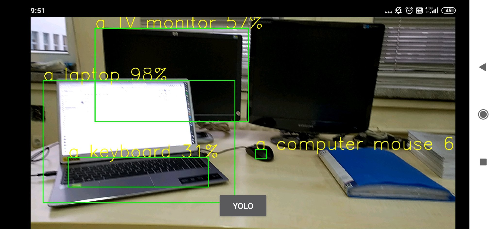

# Android-App-for-Object-Detection
This project is about develop an application using OpenCV &amp; Neural Networks with object detection goal in mind (TinyYOLOv3 in 
particular).

  

## Getting Started

Well, the project already started with a basic version off the app made. Which is just an .apk that uses the camera, and with its one 
button, when pressed; processes the frames using [yolov3-tiny](https://pjreddie.com/darknet/yolo/).

Now we are trying to achieve, fullscreen without breaking anything.

After we are gonna be trying to use the camera at 720p 30fps.

Maybe somewhere on the line we will try to get the yolo results to a txt.

## Update - 08.01.2020

The files for the object detector is added [here](https://github.com/kantarcise/Android-App-for-Object-Detection/tree/master/TinyYolov3). This is just the whole Android Studio Project; if you are just focused
to the important trio, i got you covered; you can find them down below.

[activitymain.xml](https://github.com/kantarcise/Android-App-for-Object-Detection/blob/master/TinyYolov3/app/src/main/res/layout/activity_main.xml)

[MainActivity.java](https://github.com/kantarcise/Android-App-for-Object-Detection/blob/master/TinyYolov3/app/src/main/java/com/example/tinyyolov3/MainActivity.java)

[AndroidManifest.xml](https://github.com/kantarcise/Android-App-for-Object-Detection/blob/master/TinyYolov3/app/src/main/AndroidManifest.xml)

[OpenCV347](https://opencv.org/releases/) library is implemented for the functions that are used in the mainactivity.java. 

For this code and the tutorial, all credit goes to wonderful: [Ivan Goncharov](https://github.com/ivangrov).

In the development process, I am currently working on sensor data implementation (accelerometer to be specific), to the detector, to 
improve performance of object 
detection. 
(Which is my senior design project by the way =) )

<!--
### Installing
## Running the tests
### Tips And Tricks

-->
## Help, I'm Stuck!
For any questions regarding on how to use the app, feel free to contact [Sezai](mailto:sezaiburakkantarci@gmail.com) from the mail. 
